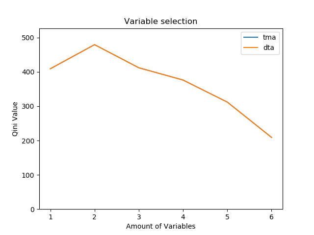
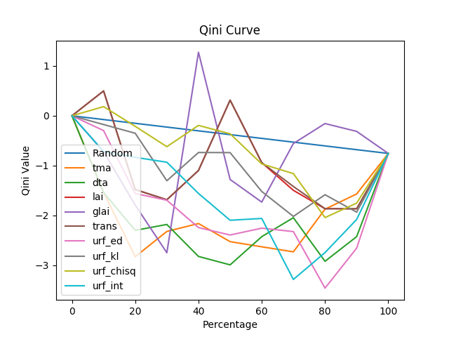
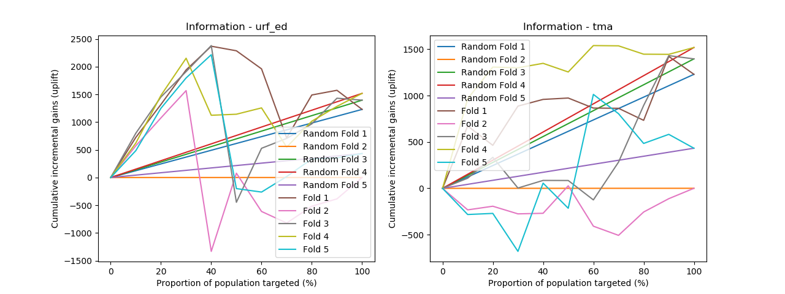
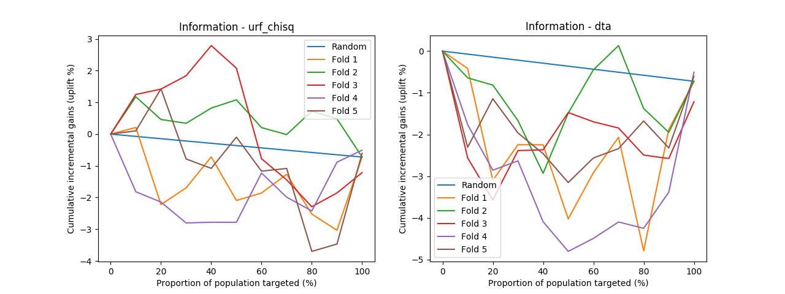
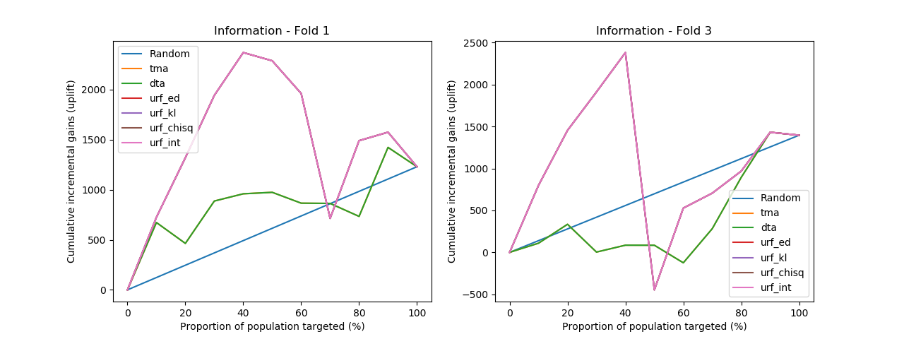
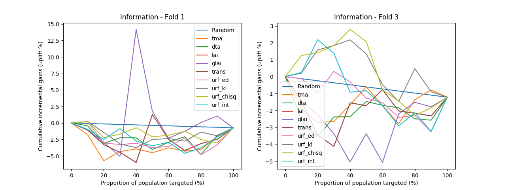

# Uplift implementation report

## 1. Check dataset
#### Dataset #1. hillstrom
Shape: (42693, 20) 
== Count of each group == 
CN    19044 
CR     2262 
TN    18149 
TR     3238 
Uplift: 0.045233106587052985

There are enough data to train.

#### Dataset #2. lalonde
Shape: (722, 9) 
== Sum of each group == 
T    2.163271e+06 
C    1.774977e+06 
== Count of each group == 
T    425 
C    297 
== Average of each group == 
T    5090.048302 
C    5976.352033 
Uplift: 886.3037307037466

Too small data prevents to train.

#### Dataset #3. criteo 
Shape: (1391, 3570) 
== Count of each group == 
CN    539 
CR     78 
TN    682 
TR     92 
Uplift: -0.007555103254473797

There are too small data with many columns. 
Number of columns will be reduced by NIV(Net Information Value). 

## 2. Figure 5. Results of the wrapper variable selection procedure (general wrapper approach)
### 2.1. hillstrom

Variable selection has been applied in combination with tma, dta, pes, and trans approaches,
but not in combination with tree-based approaches since these internally incorporate a variable selection procedure.
So there is no need from a practical perspective, and in addition,
the performance of tree-based approaches may deteriorate when adding an external variable selection procedure.

As can be seen from the experimental results shown in Figure 5, generally, the best performance in terms of the
Qini measure is achieved with a relatively small number of predictor variables in the model, that is, in between 5
and 15 predictor variables.

When adding predictor variables to the model, at first the performance of the model improves. When the optimal
number of predictor variables resulting in maximum performance is reached and more predictor variables are
added to the model, a downward trend in performance is observed. An explanation of the downward trend is
that the effect of the campaign is captured or described by a limited number of predictor variables. When adding
more predictor variables, which are either only weakly related to the effect of the campaign or strongly correlated
with the predictors already in the model, in fact noise is added to the data, leading to a decrease in terms of the
performance and generalization power of the models, or an increase in terms of stability or overfitting.

### 2.2. lalonde

Drop variables of first fold for tma are below by general wrapper approach. 
['hispanic', 'nodegree', 'education', 'black'] 
These columns will be removed when training.

### 2.3. criteo
Figure 5 is skipped for criteo dataset. 
NIV selects 50 features among 3570 features.

50 selected variables of first fold for tma are below. 
['6_3', '13_0', '15_0', '17_2', '4_1', '10_1', '25_106', '1', '4_16', '4_35', '10_16', '6_4', '2', '8_252', '9_218', '10_2', '5_1458', '17_1', '4_6', '24_11', '5_5', '25_4', '8_53', '22_8', '10_29', '5_8', '4_34', '17_4', '5_2', '5_133', '25_14', '11_0', '16_2', '4_44', '6_6', '4_185', '7_3', '5_7', '25_746', '19_0', '21_23', '9_59', '6_5', '10_36', '22_28', '8_193', '6_1', '10_0', '35_145', '25_424']

## 3. Table 6. Qini values of all methods
### 3.1. hillstrom
|          |                 Qini |         Qini top 30% |       Qini Top 10% |
|----------|:--------------------:|:--------------------:|:------------------:|
|tma       |  35.14079 (310.46356)|  28.67711 (119.94554)|  7.75662 (22.42195)|
|dta       |  35.14079 (310.46356)|  28.67711 (119.94554)|  7.75662 (22.42195)|
|urf_ed    | 395.37255 (293.20717)|   248.32375 (5.40149)|  27.47821 (4.08351)|
|urf_kl    | 395.37255 (293.20717)|   248.32375 (5.40149)|  27.47821 (4.08351)|
|urf_chisq | 395.37255 (293.20717)|   248.32375 (5.40149)|  27.47821 (4.08351)|
|urf_int   | 395.37255 (293.20717)|   248.32375 (5.40149)|  27.47821 (4.08351)|
Best model: urf_ed 
Worst model: tma

generally, the reported Qini > Qini Top 30% > Qini Top 10%.
The area under the Qini curves can be expected to be larger for an increasing fraction of the population being selected.

The standard deviation: This may signal an issue with the stability of the models
At first sight, it appears that uplift random forests consistently performs among the best techniques.
Two more techniques, dta and tma, as well perform consistently well across multiple data sets.

Uplift random forests generally performs well on most data sets.
Also, lai, glai, tma, and dta perform well in comparison.
Surprisingly, the tma technique (i.e., the two-model approach),
which is often referred to as the naive approach since relatively simple in terms of setup,
appears nonetheless to perform well in specific cases.

First of all, the Qini measures only provide an indication how well a model is performing when
compared with other models on the same data set. A comparison across data sets is not supported,
since these measures are not normalized and therefore depend on characteristics of the application.

in addition, the Qini metrics evaluate how well an uplift model ranks the full population.

### 3.2. lalonde
|          |                 Qini |         Qini top 30% |       Qini Top 10% |
|----------|:--------------------:|:--------------------:|:------------------:|
|tma       |  35.14079 (310.46356)|  28.67711 (119.94554)|  7.75662 (22.42195)|
|dta       |  35.14079 (310.46356)|  28.67711 (119.94554)|  7.75662 (22.42195)|
|urf_ed    | 395.37255 (293.20717)|   248.32375 (5.40149)|  27.47821 (4.08351)|
|urf_kl    | 395.37255 (293.20717)|   248.32375 (5.40149)|  27.47821 (4.08351)|
|urf_chisq | 395.37255 (293.20717)|   248.32375 (5.40149)|  27.47821 (4.08351)|
|urf_int   | 395.37255 (293.20717)|   248.32375 (5.40149)|  27.47821 (4.08351)|
Best model: urf_ed 
Worst model: tma

### 3.3. criteo
|          |                 Qini |         Qini top 30% |       Qini Top 10% |
|----------|:--------------------:|:--------------------:|:------------------:|
|tma       |  35.14079 (310.46356)|  28.67711 (119.94554)|  7.75662 (22.42195)|
|dta       |  35.14079 (310.46356)|  28.67711 (119.94554)|  7.75662 (22.42195)|
|urf_ed    | 395.37255 (293.20717)|   248.32375 (5.40149)|  27.47821 (4.08351)|
|urf_kl    | 395.37255 (293.20717)|   248.32375 (5.40149)|  27.47821 (4.08351)|
|urf_chisq | 395.37255 (293.20717)|   248.32375 (5.40149)|  27.47821 (4.08351)|
|urf_int   | 395.37255 (293.20717)|   248.32375 (5.40149)|  27.47821 (4.08351)|
Best model: urf_ed 
Worst model: tma

## 4. Figure 7. Qini curve for methods (average of Qini curves for all folds)
### 4.1. hillstrom

### 4.2. lalonde

### 4.3. criteo

## 5. Figure 8. Qini curve for each folds of methods: methods having best and worst Qini value for each data set
### 5.1. hillstrom

### 5.2. lalonde

### 5.3. criteo

## 6. Figure 9. performance a of all methods on Fold 1 & Fold 3
### 6.1. hillstrom

### 6.2. lalonde

### 6.3. criteo
